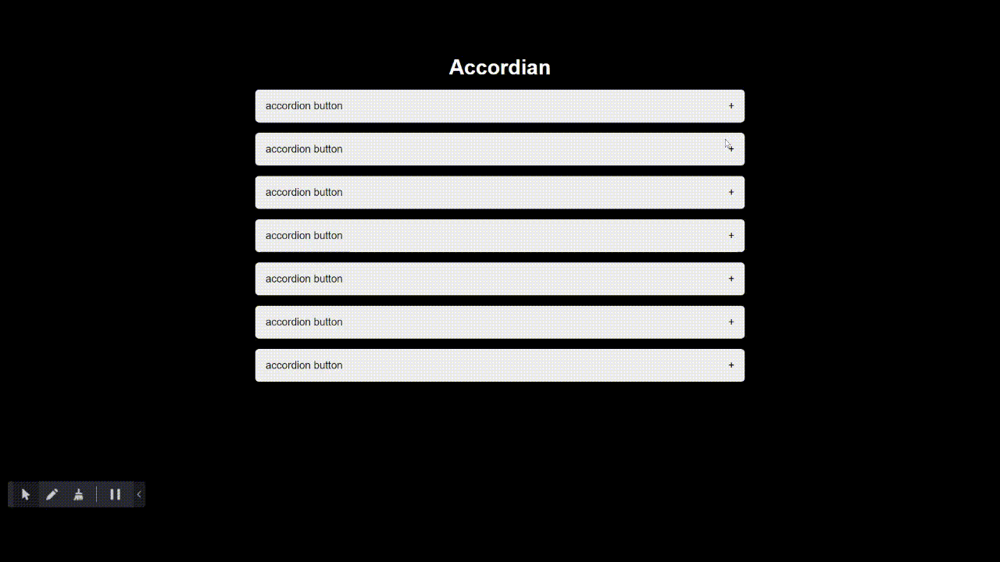

# Accordian

It can be used in any website which requires Accordian
functionality. It will enhance the ui of your website.
An accordion menu is a vertically stacked list of headers that can be clicked to reveal or hide content associated with them. It is one of many ways you can expose content to users in a progressive manner.

---

## Demo

---

## Setup

Just download and open index.html.

---

## Author

[Sumit Singh](https://github.com/wh0sumit)
