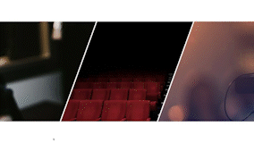

# Skewed Images Accordion

An accordion that expands on image hover and display the text. The sections are 20 degrees skewed.

-   Skewed sections without transforming the image and text
-   Preserve skew when stretched
-   Stretch and text reveal transition

## Demo

## Setup instructions

Copy the content of `index.html` and `style.css`. Change the constants for tan/sin based when applying different skew angle. 

## Detailed explanation of code

The tricky part is to calculate the negative margins. This is achieved using trigonometry, but since CSS doesn't have such functions, the values are passed as a variable. If the skew angle is changed, these variables should also be changed. 

## Author

almakon/ Alla Konstantinova

# Disclaimers

Photos from [Unsplash](https://unsplash.com/@felixmooneeram?utm_source=unsplash&utm_medium=referral&utm_content=creditCopyText):

- [Felix Mooneeram](https://unsplash.com/@felixmooneeram)
- [Jonathan Velasquez](https://unsplash.com/@felixmooneeram)
- [Kushagra Kevat](https://unsplash.com/@kushagrakevat)
