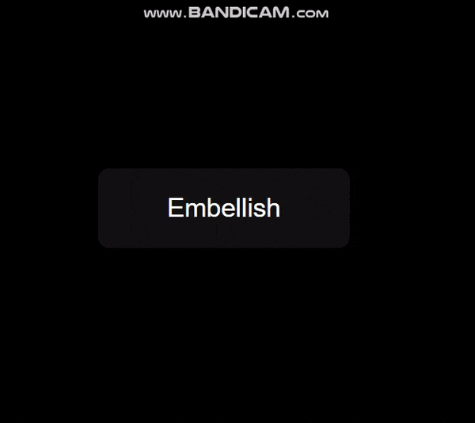

# Border-Glow-button

On hovering the border starts glowing in rainbow colours which looks cool.

# Demo

# Setup

Since it is written in HTML and CSS, adding it directly to your project and running it with an extension such as Live Server is enough to make it work.

# Author

Charvi Bansal (@Charvi-Bansal)
