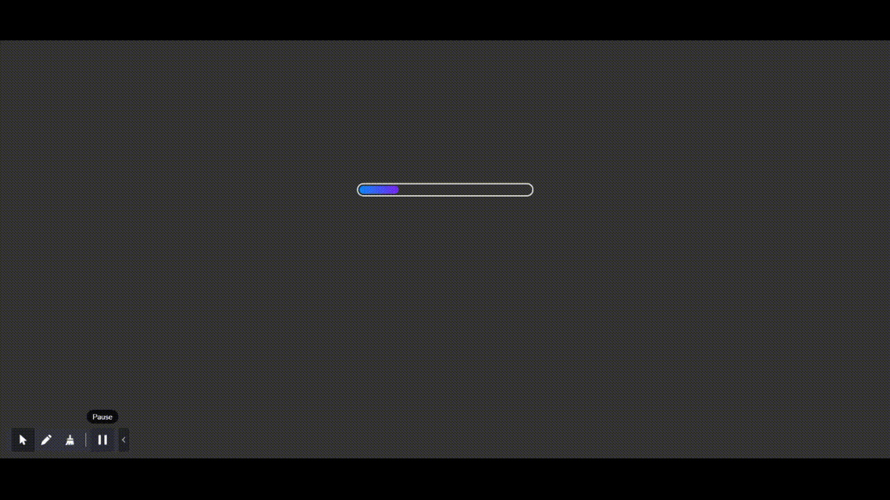

# Gradient Progress Bar
It can be used in any website which requires Progress Bar
functionality. It will enhance the ui of your website.
A progress bar shows you have much progress you've made and how much left you've got to make. Progress bars are a great way to calm your users.
***
## Demo

***
## Setup

Just download and open index.html.
***
## Author
[Sumit Singh](https://github.com/wh0sumit)
